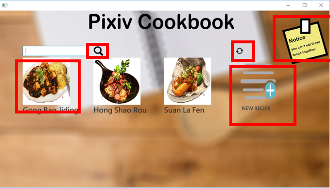
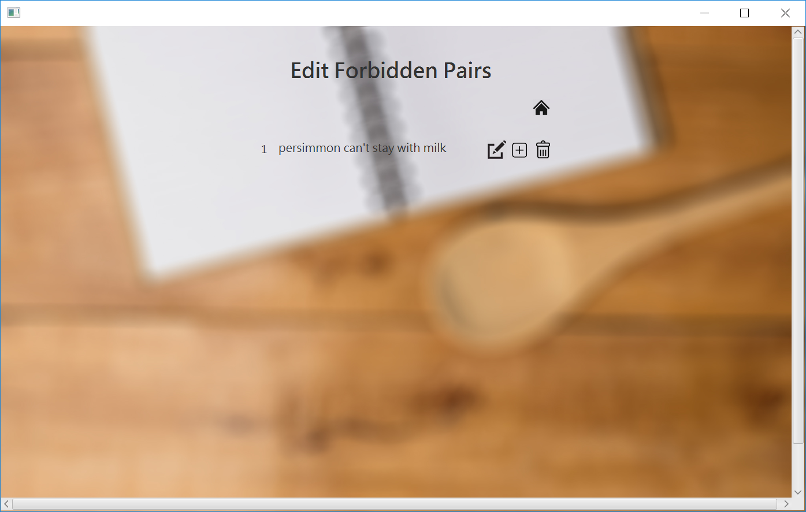

# PixivCookbook

A cookbook GUI

## Author
---
[Chen Sihan](https://github.com/Spycsh/), [Shen Yu](https://github.com/tokisamu), [Ling Wei](https://github.com/pyonkti)

## Structure
---
> This structure is the source folder structure of this project

```
+--PixivCookbook
|    +--Controller
|    |    +--DBController.java
|    |    +--EditForbiddenPairController.java
|    |    +--WindowController.java
|    +--CookBookApp.java
|    +--Default.java
|    +--Model
|    |    +--CookBook.java
|    |    +--ForbiddenPair.java
|    |    +--Ingredient.java
|    |    +--Recipe.java
|    |    +--Step.java
|    +--test
|    |    +--JunitDBController.java
|    |    +--JunitRecipe.java
|    +--View
|    |    +--ForbiddenEditWindow.java
|    |    +--MainWindow.java
|    |    +--RecipeWindow.java
|    |    +--source
                +-- More...
```

## Initialized

---
You can run CookBookApp.java or Default.java to initialize the default values in database for our digital cookbook.


## Start the Cookbook

---
You can run the WindowController.java to lauch your digital cook book

## Functions Introduction

---

### Main Window




* Add a recipe

    By clicking the "add recipe" picture can you add your own recipe.

* Edit a recipe

    By clicking the recipe picture can you edit that recipe.

* Search a recipe

    Searching the recipe by entering some content in the blank and click the search button.

* Recommend 7 recipes 

    By clicking the flush button, the main window will give 7 random recipes from the database. If you do not have more than 7 recipes, the main window will displays all.

* Edit forbidden pairs

    By clicking the "Sticky Note", you can edit some ingredients that may not be added simultaneously in one recipe. That may cause some warning during your use of the cookbook.

### Recipe Window


<center>Display</center>


<center>Edit (1)</center>


<center>Edit (2)</center>


### Forbidden Pair Window


<center>Display</center>


<center>Edit</center>

